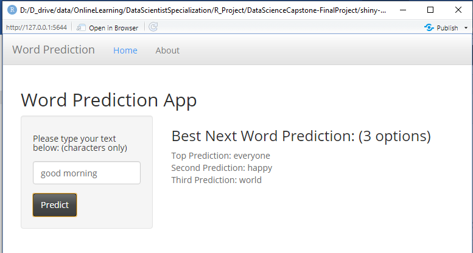

```{r setup, include=FALSE}
knitr::opts_chunk$set(echo = FALSE)
```

## Introduction

The project is to develop an online Shiny app for word prediction. The app uses NLP text prediction algorithms to predict the most likely next word, based on the word/phase entered by a user. It allows users to choose their word/phase as an input. Three options of predicted word will be displayed. The project consists of two parts:

1. Create a Shiny application and deploy it on Rstudio's servers - Shiny website 
https://kenyang.shinyapps.io/word-prediction-app/

2. Use Rstudio Presenter to prepare a reproducible pitch presentation about the application. The presentation is available in RPub
https://rpubs.com/kenyang/783243

All files are stored at Github Repository:
https://github.com/kenyang88/DataScienceCapstone-FinalProject

## Application Overview

* The application is written with Shiny package which is an interactive web application framework for R, and hosted on cloud supported by Rstudio's shiny server (Shinyapps.io).

* The source code consists of a number of files: ui.R, server.R,  1_Load_Sample.R, 2_Corpus_Cleanup.R, 3_Tokenize.R, and 4_Predict.R, etc.

* server.R includes the the server logic of a Shiny web application while ui.R includes the the user-interface definition.

* Other R files are used for data loading and preparation, data cleaning, and data dictionary generation which are to be used by the app.

## Application Panels and Widgets of Word Prediction

* SIDE PANEL: provide Input parameters for word/text by user.

* MAIN PANEL: contain a tab to display the best next word prediction.

* widget of textInput by user: A field to enter word/phase

* widget of actionButton for prediction: An Action Button to calculate

## How can we use the Word Prediction App? How it work?
1. Enter word/phase into the input textbox (by user).
2. Click the PREDICT button. Wait a second to allow for the output to appear. The top prediction will be shown up followed by the second and third ones respectively.
3. When the user continues to type text, new text word prediction will be shown up automatically after finished typing the word one by one. 

**Prediction Algorithm:** With respect to user input, the prediction algorithm calculates the probabilities of the next word occuring and presents three options of predicted word. The one associated with highest probability will be the most likely next word. However, taking into account performance issue, the prediction can only work on (at most) the last two words entered no matter how many words the user has taken.

## User Interface of Word Prediction App
